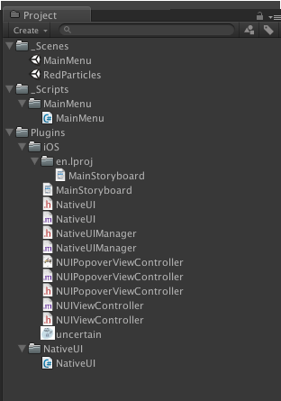

iOS Setup
=========

The easiest way to work right now is to import the Unity package containing the plugin files.
When you create you Xcode project, make sure you include the plugin Objective-C files into it. Then 
create a build phase which copies all of the necessary files (view controllers, storyboards, etc) into
your `Assets/Plugins/iOS` folder in Unity. 

Whenever you need to update your native UI, just build (not run) and it will copy the updates into 
Unity. When you need to add more files to your native project (images, view controllers, etc) just add 
them into the build phase you just created. 

If you copy a .storyboard from Xcode to Unity using a build phase, it will copy it into a localization
 folder (probably `en.lproj`). You will need to move the files up a level out of this folder, into `Plugins/iOS`, as 
subfolders are not supported Unity build process. See below, after a new build the en.lproj folder gets remade with 
a new storyboard. 

You should probably have Symlink Unity Libraries unchecked. 

### Unity build process

The .h files from `Plugins/iOS` will not show up in the Xcode project generated by Unity, but should still work. 
Any .xib files will be added to the Xcode project, but .storyboard files will not. The .storyboard files will 
get copied into the build directory, but you need to add a reference to it into the Xcode project yourself. Just 
drag the file (from your build directory) into the Xcode file heirarchy. Add it to the build target, but do not 
select the option to copy the file. If you rebuild to the same directory, the storyboard will update, you just 
need the initial reference. 

***

Documentation
=============

NativeUIManager.mm
------------------

### -addListener:(NSObject*)

>Adds a listener, to receive messages from Unity.

### -removeListener:(NSObject*)

>Removes the listener from the list.

### -sendMessageToListener:(NSString*) withMethod:(NSString*) andMessage:(NSString*)

>Performs the selector defined by `method` with the `message` parameter. Messages are passed through the 
list of listeners, and will be executed on any and all registered listeners of the specified type, which 
can perform the selector. 

### -sendMessageToGameObject:(NSString*) withMethod:(NSString*) andMessage:(NSString*)

>Wraps the [UnitySendMessage](http://docs.unity3d.com/Documentation/Manual/PluginsForIOS.html) function, for use in 
native apps. This allows testing without the Unity libraries in your project, and testing in the simulator. 

NativeUI.cs
-----------

### bool pause

>Sets whether the Unity player should pause when a native UI is shown or not.

### showStoryboard( string view )

>Loads a Storyboard UI with no animation. 

### showStoryboard( string view, NativeTransitionAnimation transition ) 

>Loads a Storyboard with the animation defined by transition. 

### showViewControllerFromXibWithAnimation( string xib, NativeTransitionAnimation transition ) 

>Loads a view controller from a XIB, and presents it as a modal view controller with an 
optional animation. 

>Note: The view controller must be the same name as the XIB.

### showViewControllerFromXibWithFrame( string xib, Rect frame )

>Loads a view controller from a XIB and presents in the specified frame, on top of Unity. The frame 
parameter generates a CGRect which internally does pixel doubling for Retina displays. 

>Note: The view is not animated, and the Unity VM is not paused. The view controller must be the 
same name as the XIB. 

### hideUI()

>Hides any native UI and resumes the Unity Player. If the view controller is animated in, it will be animated out appropriately. 

***

Common Errors
=============

Storyboard not updating
-----------------------

Sometimes the Storyboard files on the device do not get updated when the app is rebuilt. The easiest fix for this is
to just delete the app from the device and rebuild. 

libobjc.A.dylib`_cache_getImp
-----------------------------

If you get EXC_BAD_ACCESS in this, it is most likely because you are trying to load a Storyboard which does not exist.

