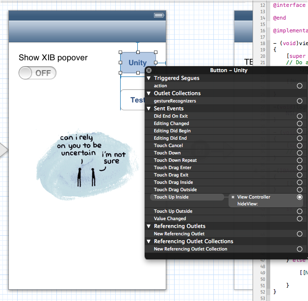

Examples
========

***

NativeUI is obviously for presenting a native view on top of Unity. Perhaps you want to do your menu 
system natively (we all know how frustrating GUI can be in Unity), or maybe you just want to present a 
single view such as a leaderboard or in-app purchase screen. The easiest way to do this is to create a 
storyboard in Xcode. Check out the [setup guide](iOS_Setup.md) for some more info on this process.


From your Unity project, you can launch the native view however you choose. For a main menu, you may 
want to present it in a Start() function in whichever scene you load first. This will launch the 
storyboard as soon as Unity has finished loading (after the splash page). In order to minimize loading 
time you should have as little as possible in the initial Unity scene. 

```csharp
void Start() {
    NativeUI.showStoryboard("MainStoryboard");
}
```

Once your native view is visible, you may want to do something in the background with Unity. There are 
methods for passing messages back and forth between the two systems. Say one of your controls loads a new scene 
in Unity. It's Action may look something like this:

```objc
-(IBAction)hideView:(UIButton*)sender
{
    [[NativeUIManager sharedManager] pauseUnity:NO];
    [[NativeUIManager sharedManager] sendMessageToGameObject:@"MainMenu"
                                                  withMethod:@"LoadScene"
                                                  andMessage:@"SomeNewScene"];
}

```

This could unpause the Unity VM and load a new scene in the background. That new scene can hide the native view 
once it has finished loading. 

Of course, you may want to only hide the native view once the user is ready to. This can be done through 
a button, a gesture, or whatever other method you need. 


```objc
-(IBAction)hideView:(UIButton*)sender
{
    [[NativeUIManager sharedManager] hideUI];
}
```


