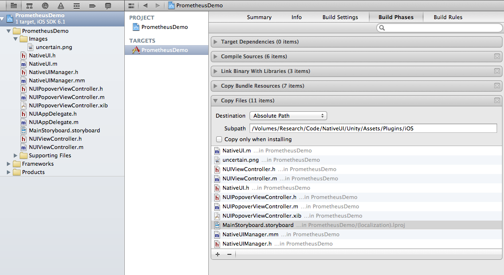
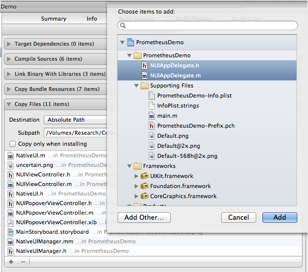

iOS Setup
=========

***

The easiest way to work right now is to import the Unity package containing the plugin files.
When you create you Xcode project, make sure you include the plugin Objective-C files into it. Then 
create a build phase which copies all of the necessary files (view controllers, storyboards, etc) into
your `Assets/Plugins/iOS` folder in Unity. 




Whenever you need to update your native UI, just build (not run) and it will copy the updates into 
Unity. When you need to add more files to your native project (images, view controllers, etc) just add 
them into the build phase you just created. 




If you copy a .storyboard from Xcode to Unity using a build phase, it will copy it into a localization
 folder (probably `en.lproj`). You will need to move the files up a level out of this folder, into `Plugins/iOS`, as 
subfolders are not supported Unity build process. See below, after a new build the en.lproj folder gets remade with 
a new storyboard. 


You should probably have Symlink Unity Libraries unchecked. 


### Unity build process

The .h files from `Plugins/iOS` will not show up in the Xcode project generated by Unity, but should still work. 
Any .xib files will be added to the Xcode project, but .storyboard files will not. The .storyboard files will 
get copied into the build directory, but you need to add a reference to it into the Xcode project yourself. Just 
drag the file (from your build directory) into the Xcode file heirarchy. Add it to the build target, but do not 
select the option to copy the file. If you rebuild to the same directory, the storyboard will update, you just 
need the initial reference. 


XUPorter
--------

[XUPorter](https://github.com/cbaltzer/XUPorter) is a Unity plugin for modifying the Xcode project that Unity 
produces. It has subfolder support, which can help keep your project organized. It is highly recommended, and 
the NativeUI package has been re-organized to use it. 

To install it, either copy the files into your project, or add it as a git submodule. 

```
git submodule add git@github.com:cbaltzer/XUPorter.git Assets/Editor/XUPorter
git submodule init
git submodule update
```


Common Errors
=============

***

Storyboard not updating
-----------------------

Sometimes the Storyboard files on the device do not get updated when the app is rebuilt. The easiest fix for this is
to just delete the app from the device and rebuild. 


libobjc.A.dylib`_cache_getImp
-----------------------------

If you get EXC_BAD_ACCESS in this, it is most likely because you are trying to load a Storyboard which does not exist.


